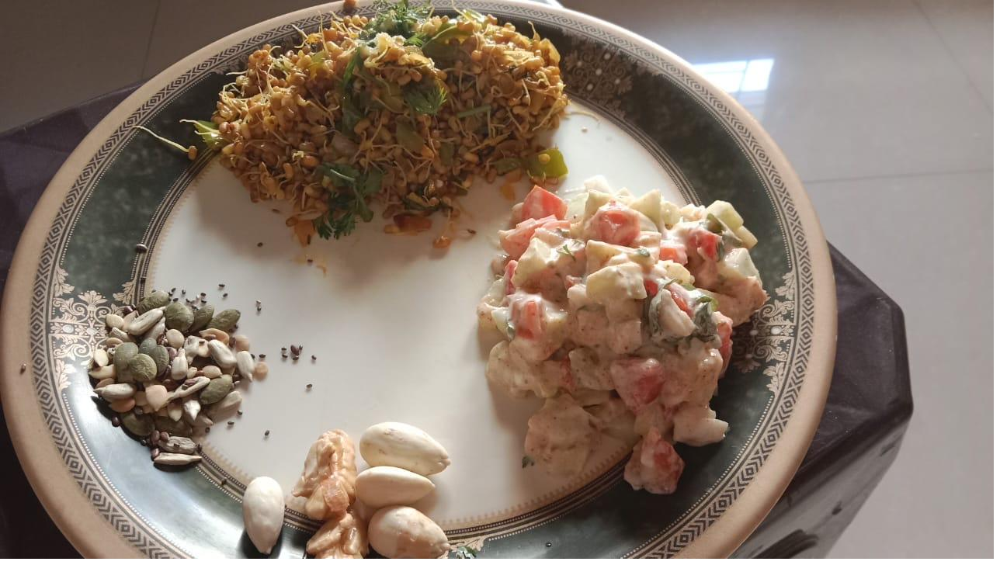

# ProteinPlate

**A free, practical guide to high-protein, lower-calorie Indian home meals.**

Most healthy-eating advice is abstract. ProteinPlate is the opposite: it documents *one simple, repeatable plate* — built from dozens of real home-cooked meals — with portions in grams, recipes for a family of 4, a batch-cooking plan, and a grocery list you can actually shop from.

!!! tip "The whole idea in one line"
    **Half the plate non-starchy veg (cooked + raw) · a quarter protein · a small corner of healthy fat (nuts/seeds + a little oil) · a glass of thin dairy.**



## The template

```
[ 1 PROTEIN ANCHOR ]  +  [ 1–2 COOKED VEG ]  +  [ 1–2 RAW SALADS ]
        +  [ a little DAIRY ]  +  [ a small fistful of NUTS & SEEDS ]
        ( optional: a soup, a savoury pancake, or a dip like hummus )
```

What's deliberately **missing** matters as much as what's present: almost no rice, roti, bread, potato, or sugar. That, plus lean protein and non-starchy vegetables, is what keeps a plate around **450–600 kcal with 30–45 g protein**.

## The protein rotates across five families

| Protein family       | Forms                                                              |
|----------------------|-------------------------------------------------------------------|
| Sprouts / legumes    | Moong sprouts usal, chana masala, brown/black chana, sprout chaat |
| Paneer               | Pan-grilled slices/cubes, paneer bhurji                           |
| Eggs                 | Boiled eggs, vegetable omelette, egg bhurji                       |
| Chicken              | Pan/tawa chicken tikka, chicken–vegetable stir-fry                |
| Lentil/besan "binder"| Besan or moong *cheela*, multigrain *thalipeeth*                   |

## Where to go next

- **[The Plate](the-plate.md)** — an annotated plate, with every item and its portion
- **[Ingredients & Portions](ingredients.md)** — each dish mapped to its raw ingredients
- **[Recipes](recipes.md)** — the cookbook, scaled for 4, with video links
- **[Meal Plan](meal-plan.md)** — a starter week you can customize day by day
- **[Grocery List](grocery-list.md)** — one week, family of 4
- **[Keto Chapter](keto.md)** — an optional stricter low-carb variation

!!! warning "Please read"
    ProteinPlate is **general food and wellness information, not medical advice.** Your real calorie and protein targets are personal — see the [health note](about.md).

!!! tip "Use it in the kitchen and the shop"
    On a phone, open your browser menu and choose **Add to Home Screen** to
    install ProteinPlate as an app. It opens full-screen and works **offline** —
    handy for ticking off the grocery list in the aisle.
