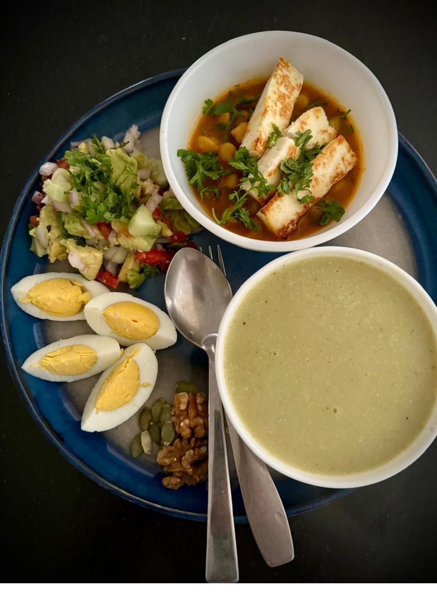
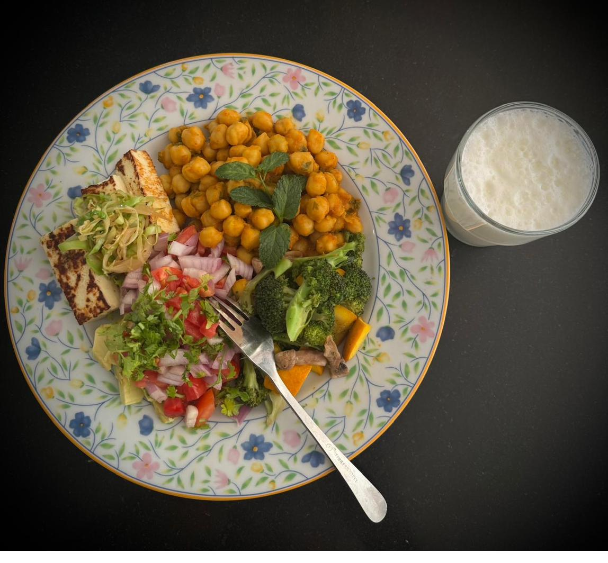
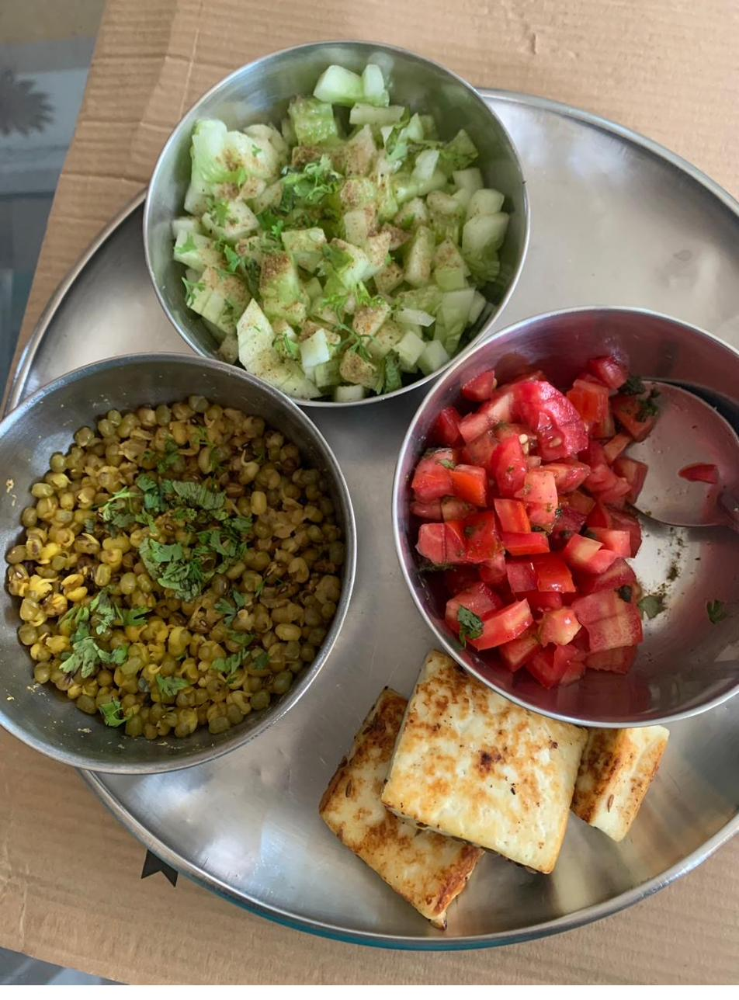
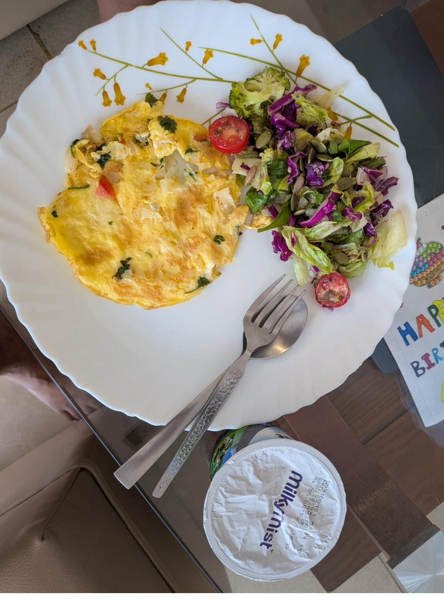
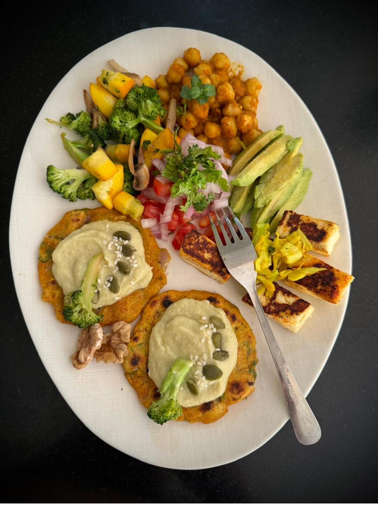
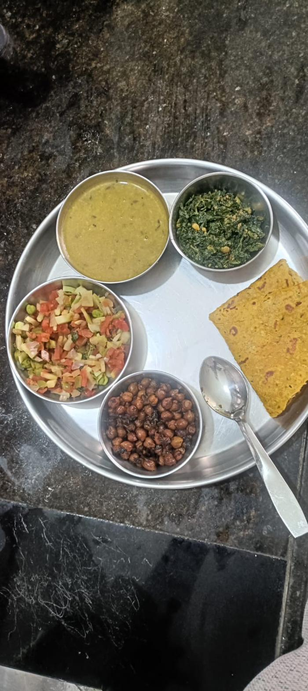

# The Plate

Here is how a single plate breaks down, component by component, with portions estimated for **one person, one meal**.

## A richer plate

| # | Item                   | What it is                              | Est. portion (1 person)       |
|---|------------------------|-----------------------------------------|-------------------------------|
| 1 | Boiled eggs (halved)   | 2 eggs, hard-boiled                     | ~100 g (2 eggs)               |
| 2 | Chana + grilled paneer | Chickpea curry topped with seared paneer| ~120 g chana + ~60 g paneer   |
| 3 | Green soup             | Bottle gourd / spinach / broccoli       | ~200 ml                       |
| 4 | Avocado kachumber      | Avocado, onion, tomato, cucumber, herbs | ~120 g                        |
| 5 | Nuts + seeds corner    | Walnut, almonds, pumpkin seeds          | ~15 g nuts + ~10 g seeds      |

## A simpler everyday plate

| # | Item                 | What it is                             | Est. portion (1 person) |
|---|----------------------|----------------------------------------|-------------------------|
| 1 | Chana masala         | Chickpeas in a light onion-tomato masala | ~150 g                |
| 2 | Grilled paneer       | Pan-seared slices                      | ~80 g                   |
| 3 | Kachumber + broccoli | Onion-tomato-coriander + sautéed veg   | ~150 g                  |
| 4 | Buttermilk (chaas)   | Thin spiced yogurt drink               | ~200 ml                 |

!!! note "Plate logic worth memorising"
    *Half the plate non-starchy veg (cooked + raw), a quarter protein, a small corner of fat (nuts/seeds + cooking oil), and a glass of thin dairy.*

## More real examples

- 
  **Moong + paneer + salads**

- 
  **Omelette + leafy salad + curd**

- 
  **Cheela + hummus + veg + paneer**

- 
  **A fuller thali**

